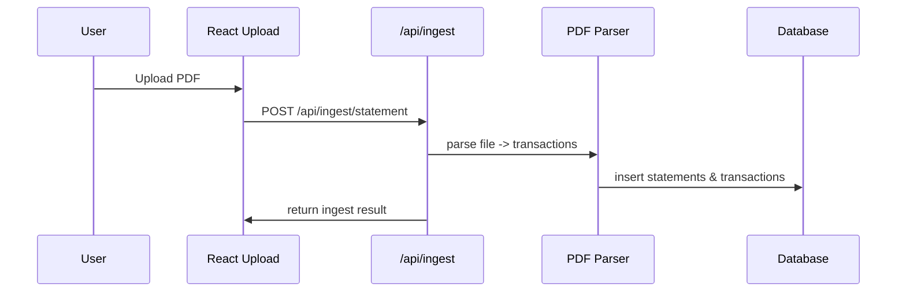

# Project Architecture Blueprint

Generated: 2026-03-29

This document analyzes the codebase to capture the architecture, boundaries, implementation patterns, and guidance for future development. It was produced by scanning the repository structure and key files; links to source locations are provided for verification.

## **Executive Summary**
- **Primary stacks**: Python FastAPI backend and React + TypeScript frontend.
- **Primary pattern**: Layered / modular monolith for backend (Routers → Services → Models → Persistence). Frontend is a component-driven SPA with feature pages and an API client.
- **Data layer**: SQLAlchemy (async) with SQLite (dev) and Alembic for migrations.
- **Runtime**: Async FastAPI app served by `uvicorn`; frontend served by Vite with a proxy to the backend during development.

## **Detected Technologies & Evidence**
- **Python / FastAPI**: [backend/pyproject.toml](backend/pyproject.toml) (dependencies include `fastapi`, `uvicorn`, `sqlalchemy[asyncio]`). See app entry: [backend/app/main.py](backend/app/main.py).
- **SQLAlchemy (async) + Alembic**: [backend/pyproject.toml](backend/pyproject.toml) and [backend/alembic](backend/alembic) folder. Database layer at [backend/app/database.py](backend/app/database.py).
- **React + TypeScript + Vite**: [frontend/package.json](frontend/package.json) and [frontend/vite.config.ts](frontend/vite.config.ts). App entry: [frontend/src/App.tsx](frontend/src/App.tsx).
- **Testing**: `pytest`, `pytest-asyncio`, and `httpx` listed as dev deps in [backend/pyproject.toml](backend/pyproject.toml); tests under [backend/tests](backend/tests).

## **Architecture Detection and Analysis**
- The repository is a two-part application: a backend (directory `backend/`) and a frontend (directory `frontend/`). Evidence: package manifests and framework-specific entrypoints.
- Backend organizes code by responsibility: `routers` (HTTP controllers), `services` (business logic), `models` (SQLAlchemy domain models), `schemas` (Pydantic request/response models), and `database` (engine/session). Example: [backend/app/routers/transactions.py](backend/app/routers/transactions.py) + [backend/app/services/categoriser.py](backend/app/services/categoriser.py).
- Communication is primarily synchronous HTTP (frontend → backend) and asynchronous within the backend using async/await and SQLAlchemy async sessions.
- The architecture is a modular layered monolith with clear module boundaries enforced by directory structure and import conventions.

## **Architectural Overview**
- **Guiding principles observed**: small focused modules, separation of concerns (routers vs services vs models), explicit DI via FastAPI `Depends`, async-first IO for non-blocking behavior.
- **Boundaries**: HTTP surface (routers) → application services (business logic) → persistence layer (SQLAlchemy). Parsers and ingestion are implemented as services that write to persistence.
- **Hybrid patterns**: A small in-process caching layer (rules cache in `categoriser`) and dev conveniences (automatic table creation in app lifespan) complement the layered architecture.

## **Architecture Visualization**
High-level flow (Mermaid):

```mermaid
flowchart LR
  subgraph Frontend
    FE[React SPA (frontend/src)]
  end
  subgraph Backend
    API[FastAPI app (backend/app/main.py)]
    Routers[API Routers (backend/app/routers/*)]
    Services[Services (backend/app/services/*)]
    Models[Domain Models (backend/app/models/*)]
    DB[SQLite / SQLAlchemy / Alembic (data/ + backend/alembic)]
  end
  FE -->|HTTP JSON (/api)| API
  API --> Routers
  Routers --> Services
  Services --> Models
  Models --> DB
  Services -->|parsing| Parser[PDF Parsers (backend/app/services/pdf_parser/*)]
  Parser --> DB
```

Sequence for statement ingestion (Mermaid):



## **Core Architectural Components**

- **API (FastAPI app)**
  - **Purpose**: HTTP surface for SPA and API clients; lifecycle management (see `lifespan` in [backend/app/main.py](backend/app/main.py)).
  - **Internal structure**: `main.py` registers middleware, CORS, routers and application startup tasks (DB init, rule migration, rule-loading).
  - **Interactions**: `app.include_router(...)` exposes feature routers; each router depends on DB session via `get_session` in [backend/app/database.py](backend/app/database.py).
  - **Evolution**: Add more routers under `backend/app/routers` and register in `main.py`.

- **Routers (presentation layer)**
  - **Purpose**: Translate HTTP requests to application operations; perform request validation using Pydantic schemas.
  - **Internal structure**: One router per feature (e.g., `transactions`, `ingest`, `rules`, `analytics`). Example: [backend/app/routers/transactions.py](backend/app/routers/transactions.py).
  - **Interaction patterns**: Routers call `services` functions and use `Depends(get_session)` to obtain DB sessions (DI pattern).
  - **Evolution**: Keep routers thin; put logic in services for testability.

- **Services (application/business logic)**
  - **Purpose**: Encapsulate business rules and workflows (e.g., categorisation, deduplication, parsing, analytics).
  - **Internal structure**: Synchronous or async functions receiving a DB session and domain inputs. Examples: [backend/app/services/categoriser.py](backend/app/services/categoriser.py) and [backend/app/services/deduplication.py](backend/app/services/deduplication.py).
  - **Interaction patterns**: Services use SQLAlchemy ORM models and explicit commits/refreshes; some services maintain in-memory caches (rules).
  - **Evolution**: Services are the primary extension point for new features and reuse.

- **Domain Models & Schemas**
  - **Purpose**: `models` define DB schema (SQLAlchemy `Base` subclasses); `schemas` define validation and serialization (Pydantic).
  - **Internal structure**: Mapped classes under [backend/app/models](backend/app/models); example: [backend/app/models/transaction.py](backend/app/models/transaction.py) and [backend/app/models/statement.py](backend/app/models/statement.py).
  - **Interaction patterns**: Services and routers convert between Pydantic schemas and ORM models.
  - **Evolution**: Add columns and migrations via Alembic; prefer non-destructive migrations where possible.

- **Persistence & Database**
  - **Purpose**: Async DB access and session management.
  - **Implementation**: [backend/app/database.py](backend/app/database.py) creates `engine` and `async_sessionmaker`; `get_session` yields an `AsyncSession` for DI.
  - **Notes**: Default `DATABASE_URL` is SQLite (`sqlite+aiosqlite:///./data/spending.db`) configured in [backend/app/config.py](backend/app/config.py).

- **PDF Parsers (ingestion)**
  - **Purpose**: Parse provider-specific PDF bank statements into a canonical transaction model.
  - **Implementation**: Parsers under [backend/app/services/pdf_parser](backend/app/services/pdf_parser). They are invoked by `ingest` router and persist statements/transactions.

- **Frontend (React SPA)**
  - **Purpose**: Single-page UI providing upload, transaction review, rules management, analytics and budgeting.
  - **Structure**: Pages in `frontend/src/pages`, reusable components in `frontend/src/components`, and a typed API client in [frontend/src/api/client.ts](frontend/src/api/client.ts).
  - **Interaction patterns**: Client uses `fetch` wrapper `request()` to call backend endpoints under `/api` (which Vite proxies to backend during dev).

## **Architectural Layers and Dependencies**
- Layered map (top → bottom):
  - Presentation: `routers` (HTTP) and `frontend` UI
  - Application: `services`
  - Domain: `models`, `schemas`
  - Persistence: `database`, Alembic migrations, raw DB
- Dependency rules:
  - `routers` may depend on `services` and `schemas`.
  - `services` may depend on `models` and `database` but should not import from `routers`.
  - `models` should be independent of `services`/`routers` but may reference `Base` and SQLAlchemy types.
- Observed violations: none obvious from structure; avoid importing routers into services to keep separation.

## **Data Architecture**
- Domain model highlights:
  - `Statement` (1) ←→ (many) `Transaction` (see [backend/app/models/statement.py](backend/app/models/statement.py) and [backend/app/models/transaction.py](backend/app/models/transaction.py)).
  - `CategorizationRule` drives automatic tagging (used by `categoriser`).
- Access patterns: services use SQLAlchemy ORM queries and explicit commits/refreshes; examples in [backend/app/routers/transactions.py](backend/app/routers/transactions.py).
- Caching: In-memory rule cache in `categoriser` (`_rules_cache`). Consider replacing with external cache (Redis) if scaling beyond single process.
- Validation: Input/output validation uses Pydantic schemas under [backend/app/schemas](backend/app/schemas).

## **Cross-Cutting Concerns Implementation**

- **Authentication & Authorization**:
  - Flagged but not implemented by default. `AUTH_ENABLED` is a toggle in [backend/app/config.py](backend/app/config.py); the auth router returns 403 when disabled ([backend/app/routers/auth.py](backend/app/routers/auth.py)).
  - Recommendation: adopt OAuth2 / JWT or integrate with an external identity provider; centralize credential checks in a dependency (e.g., `get_current_user`).

- **Error Handling & Resilience**:
  - Uses FastAPI `HTTPException` for request-level errors. Services raise or return domain errors handled at router level.
  - No circuit-breaker/retry library observed; for external integrations (if any) add `tenacity`-based retries.

- **Logging & Monitoring**:
  - Basic logging via Python `logging` (configured by environment/logging setup). No centralized observability found (Sentry, Prometheus) in the repo.
  - Recommendation: add structured logging and optionally metrics endpoints or instrumentation (Prometheus client) for key services.

- **Validation**:
  - Request/response validation uses Pydantic schemas (see [backend/app/schemas](backend/app/schemas)). Keep business validation in services, request validation in schemas.

- **Configuration Management**:
  - Uses `pydantic-settings` (`Settings`) reading `.env` by default ([backend/app/config.py](backend/app/config.py)).
  - Secrets handled via environment variables; no secret store integration present.

## **Service Communication Patterns**
- Frontend ↔ Backend: HTTP/JSON REST API. Vite proxies `/api` to backend in development ([frontend/vite.config.ts](frontend/vite.config.ts)).
- Internal backend communication: direct function calls and async DB operations.
- No service discovery, messaging or event bus present — the app is a monolith.

## **Technology-Specific Architectural Patterns**

#### Python / FastAPI
- Async-first application using `async def` endpoints and SQLAlchemy `async_session` (`asyncio` driver).
- DI via FastAPI `Depends`; app lifespan used for startup tasks (`lifespan` in [backend/app/main.py](backend/app/main.py)).
- ORM-first domain modelling with SQLAlchemy mapped classes and Alembic for migrations.

#### React + TypeScript
- Component-driven UI with route-based pages (`react-router-dom`).
- Lightweight state management: local component state and hooks; typed API client (`frontend/src/api/client.ts`).
- Build and dev served by Vite; TypeScript `strict` settings enabled in [frontend/tsconfig.json](frontend/tsconfig.json).

## **Implementation Patterns**
Specific, concrete patterns found and recommended templates.

- **Dependency Injection / DB Session**

Backend pattern (existing):

```py
# backend/app/database.py
async def get_session() -> AsyncGenerator[AsyncSession, None]:
    async with async_session() as session:
        yield session
```

Usage in a router:

```py
@router.get("", response_model=dict)
async def list_transactions(session: AsyncSession = Depends(get_session)):
    result = await session.execute(select(Transaction))
    ...
```

- **Service implementation pattern**: keep business logic in `services/*` and keep routers thin. Example: `categoriser` exposes `categorise()` and `recategorise_all()`.

- **Frontend API client (single request wrapper)**

```ts
// frontend/src/api/client.ts
async function request<T>(path: string, init?: RequestInit): Promise<T> {
  const res = await fetch(`/api${path}`, init)
  if (!res.ok) throw new Error(...)
  return res.json()
}
```

Use this `request` wrapper for all API calls to centralize error handling and auth headers.

## **Testing Architecture**
- Tests live under [backend/tests](backend/tests) and use `pytest` + `pytest-asyncio` for async tests. Example: [backend/tests/test_categoriser.py](backend/tests/test_categoriser.py).
- Integration-style tests can be written using `httpx.AsyncClient` against the FastAPI app and fixtures in `conftest.py`.

## **Deployment Architecture**
- Development: run backend (uvicorn) and frontend (Vite) with Vite proxying `/api` to backend. Vite config: [frontend/vite.config.ts](frontend/vite.config.ts).
- Production: repo does not include Docker manifests or orchestration. Typical production patterns:
  - Build frontend `vite build` and serve static files behind a CDN or static file server; host API as ASGI app (Uvicorn/Gunicorn + Uvicorn workers).
  - Use RDS/Postgres or managed DB instead of SQLite for production.
  - Run Alembic migrations before deployment.

## **Extension and Evolution Patterns**

If focusing on extensibility, follow these patterns:

- **Feature addition (backend)**
  1. Add DB model(s) under `backend/app/models` (create Alembic revision for schema changes).
  2. Add Pydantic schemas under `backend/app/schemas`.
  3. Add service functions under `backend/app/services` implementing business logic.
  4. Add a router under `backend/app/routers` and register it in `backend/app/main.py`.
  5. Add tests under `backend/tests` and update `conftest.py` fixtures if needed.

- **Feature addition (frontend)**
  1. Add page component under `frontend/src/pages` and route in `App.tsx`.
  2. Add presentational components under `frontend/src/components` and share typed interfaces in `frontend/src/api/client.ts` as needed.
  3. Use the API client for backend calls and add tests (Jest / React Testing Library) as appropriate.

## **Implementation Examples**
- Layer separation example (API -> service -> DB): see [backend/app/routers/transactions.py](backend/app/routers/transactions.py) and [backend/app/services/categoriser.py](backend/app/services/categoriser.py).
- Extension point example: add a new parser file `backend/app/services/pdf_parser/newbank.py` and register detection logic in the `ingest` service.

## **Architectural Governance**
- Automated checks observed: `ruff`, `pyright`, and `black` configured under [backend/pyproject.toml](backend/pyproject.toml). Frontend uses TypeScript strict mode.
- Recommended additions:
  - Add CI workflow to run linters and tests on PRs.
  - Add architectural ADRs directory for recording design decisions.

## **Blueprint for New Development (Quick Start)**
- Backend dev run (example):

```bash
cd backend
# create venv, install deps (hatch/pip) and run
uvicorn app.main:app --reload --port 8000
```

- Frontend dev run (example):

```bash
cd frontend
npm install
npm run dev
```

- Typical add-feature checklist (backend): create model → alembic revision → service → router → tests → docs.

---

## **References (key files)**
- App entry: [backend/app/main.py](backend/app/main.py)
- DB session: [backend/app/database.py](backend/app/database.py)
- Categoriser service: [backend/app/services/categoriser.py](backend/app/services/categoriser.py)
- Transactions router: [backend/app/routers/transactions.py](backend/app/routers/transactions.py)
- Models: [backend/app/models/transaction.py](backend/app/models/transaction.py), [backend/app/models/statement.py](backend/app/models/statement.py)
- Frontend entry: [frontend/src/App.tsx](frontend/src/App.tsx)
- Frontend API client: [frontend/src/api/client.ts](frontend/src/api/client.ts)
- Project config: [backend/pyproject.toml](backend/pyproject.toml), [frontend/package.json](frontend/package.json)

---

If you want, I can:
- run the test suite now (backend) and report failures,
- add CI workflow (GitHub Actions) to run linters/tests,
- or create ADRs for major architectural decisions.

If you want any section expanded (diagrams at different C4 levels, ADRs, or ready-to-run templates), tell me which and I will continue.
